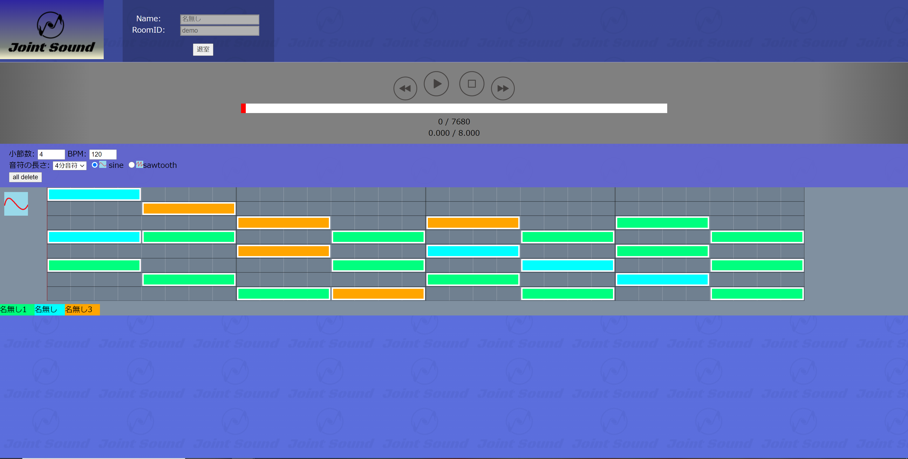

# Joint Sound

## 製品概要
### 背景(製品開発のきっかけ、課題等）
* 2020年、人と話す機会が激減、**さびしい**
* オンライン飲み会が企画された時期もあったが、共通の話題がないためか、消滅  
* 頻繁に通話する人は、同じ作業や同じゲームをしている
* **一緒に物を作る**ことは楽しい！今回は音楽に着目した
* 手軽にメロディを共有する手段が欲しい(作曲用途)

### 製品説明（具体的な製品の説明）
* [サンプル動画(YouTube)](https://www.youtube.com/watch?v=BeeXIo4oFaA)
* ブラウザ上で作曲ができるオンラインDAW
* 同じRoomに入っている人で、同時に編集可能、あとから編集も可能
* ファイル構成
    * server_code/334jst_server/ : サーバサイドのコードです．別のサーバにて運用されています．
    * web-front: フロントエンドのコードです．本体は index.html です．
* [Heroku上で稼働しています．](https://jointsound.herokuapp.com)

### 特長
* 同時に音楽を創ることができるオンラインDAW  
* 複数の音色を使用可能  
* 音符の配置・削除はクリックするだけの簡単操作
* データベースによる部屋の永続化  

### 解決出来ること  
* 共同作業を通した、寂しさの軽減  
* 話題作り機会の創出  
* 簡単なメロディを共有したいだけの時などのDTM立ち上げ等の煩わしさの軽減  

### 今後の展望
* 使用できる音色を増やす  
* 録音した音源を使える機能の追加  
* 創作した音のダウンロード  
* リアルタイム性の向上  
* 操作性の改善

### 注力したこと（こだわり等）
* リアルタイム同時作業に対応  
    * 音符を配置した人で色分け
* 作業の視認性の向上  
* 音色を増やすことが内部的には容易  
* [スタンダードMIDIファイル](https://ja.wikipedia.org/wiki/スタンダードMIDIファイル)を参考に、内部での時間処理を規格化（４分音符を480とした）。これにより時間を整数で扱うことができ、BPM変化等に柔軟に対応可能になった。

## 開発技術
### 活用した技術
#### API・データ
* Web Audio API

#### フレームワーク・ライブラリ・モジュール
* サーバサイド
    * flask  
* フロントエンド
    * axios  
    * Vue.js  
    * Vuex  
* デプロイ等
    * Heroku  

### 独自技術
#### ハッカソンで開発した独自機能・技術
* 譜面がフレーム内で流れるようにした
* ノーツを置いた人ごとに色分け表示

